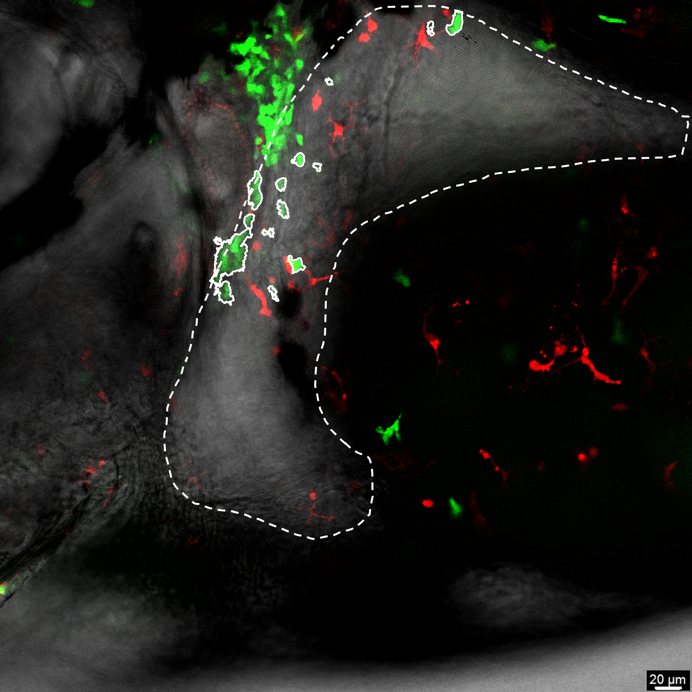

# neutrophils和macrophage數量計算
## 環境設置
1. opencv-python 4.12.0.88
1. numpy 2.1.2
## 用法
```
cd ./nhri/liver  #進入liver資料夾
./main.py --mix_dir 圖片位置
#example python main.py --mix_dir ./1/1_channel_mix.tif
```
## 實驗結果
在result產生red.jpg和green.jpg各自顯示macrophage和neutrophil，在output.txt顯示macrophage和neutrophil數量 <br>


